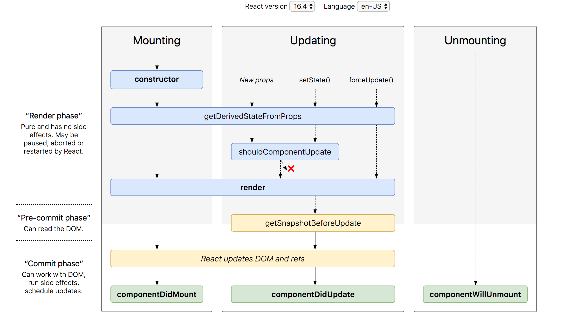

## Summary
- JSX 개념, 문법을 이해할 수 있습니다.
- React 의 Fiber 아키텍처에 대해 이해할 수 있습니다.

## Advantages
### 1. JSX
<strong>JSX와 Babel</strong>

JSX는 JavaScript의 확장으로, React 요소를 생성하기 위해 사용되는 문법입니다. 이는 마크업과 함께 자바스크립트 코드를 작성할 수 있게 해주어 UI 구성요소를 직관적으로 표현할 수 있게 해 줍니다. 

하지만 브라우저는 JSX를 기본적으로 이해하지 못합니다. 

이 문제를 해결하기 위해, 개발자들은 주로 Babel이라는 트랜스파일러를 사용하여 JSX 코드를 브라우저가 이해할 수 있는 일반 JavaScript 코드로 변환합니다.

<strong>Babel의 역할</strong>

Babel은 최신 JavaScript 코드를 오래된 브라우저에서도 호환될 수 있도록 변환하는 트랜스파일러입니다. React에서는 주로 JSX 문법을 사용하는 JavaScript 코드를 변환하는 데 사용됩니다. Babel은 JSX를 React.createElement 호출로 변환합니다. 

이 과정에서 각 JSX 태그는 JavaScript 함수 호출로 변환되며, 결과적으로 브라우저에서 이해할 수 있는 JavaScript 코드로 만들어집니다.

#### 변환 전

```js
const element = <h1>Hello, world!</h1>;
```

#### 변환 후

```js
const element = React.createElement('h1', null, 'Hello, world!');
```

### 2. Fiber
#### Fiber란
Fiber는 React의 핵심 알고리즘을 재구현한 것으로, React 16에서 도입되었습니다. 기존에 `Stack` 구조를 바탕으로 구현되었던 `Stack Reconciler`에 비해 더 유연하며, 인터랙티브한 UI를 생성하는 데 더 효과적입니다. 

#### Fiber의 역할
- <strong>비동기 렌더링</strong><br/>
React Fiber는 작업을 중단하고 필요에 따라 다시 시작할 수 있는 능력을 갖추고 있습니다. 이를 통해 React는 사용자의 인터랙션과 같은 중요한 작업에 우선 순위를 두고, 배경에서 실행되는 작업은 나중에 처리할 수 있습니다. <br/>
- <strong>우선 순위 부여</strong> <br/>
다양한 업데이트에 우선 순위를 부여하여 중요한 업데이트를 먼저 처리할 수 있습니다. 예를 들어, 애니메이션 관련 작업은 사용자 입력 처리보다 낮은 우선 순위를 가질 수 있습니다. <br/>
- <strong>리소스 활용 최적화</strong> <br/>
작업을 조각내어 메인 스레드의 활용도를 최적화합니다. 이를 통해 더 매끄러운 사용자 경험을 제공할 수 있습니다.

#### Fiber의 구조
Fiber는 평범한 자바스크립트 객체로 이루어져 있고, 각 React 요소에 대한 작업 단위를 나타냅니다. 기본적으로 하나의 Fiber는 하나의 React 요소와 일치합니다.

#### Fiber의 동작 방식
Fiber의 작업은 크게 두 단계로 나뉩니다.

<strong>렌더링 단계(Reconciliation/Render Phase)</strong><br/>
이는 render 및 라이프사이클의 getDerivedStateFromProps와 shouldComponentUpdate에 해당합니다. 

Fiber는 렌더링 단계에서 시작하여 컴포넌트의 변경 사항을 결정하고 무엇을 업데이트할지 계획합니다. 중단되거나 나중에 다시 시작될 수 있으며, 이는 Fiber의 비동기 능력과 관련이 있습니다. 사용자에게 노출되지 않는 모든 비동기 작업을 수행합니다. 이 단계는 사이드 이펙트가 없으며 ('pure'), 메인 스레드의 작업을 방해하지 않습니다.

<strong>커밋 단계(Commit Phase)</strong><br/>
이는 componentDidMount, getSnapshotBeforeUpdate, componentDidUpdate, 그리고 componentWillUnmount와 같은 라이프사이클 메소드에 해당합니다. 

렌더링 단계에서 계획된 변경 사항을 실제 DOM에 적용하는 단계로, 커밋 단계에서는 실제 DOM 작업이 발생하고, 이 단계는 중단할 수 없습니다.



## Wrap-up
- 결과적으로, Fiber 아키텍처는 React 라이프사이클을 개선하여 비동기적이고 우선 순위가 있는 방식으로 작업을 관리한다는 것을 이해할 수 있게 됩니다.