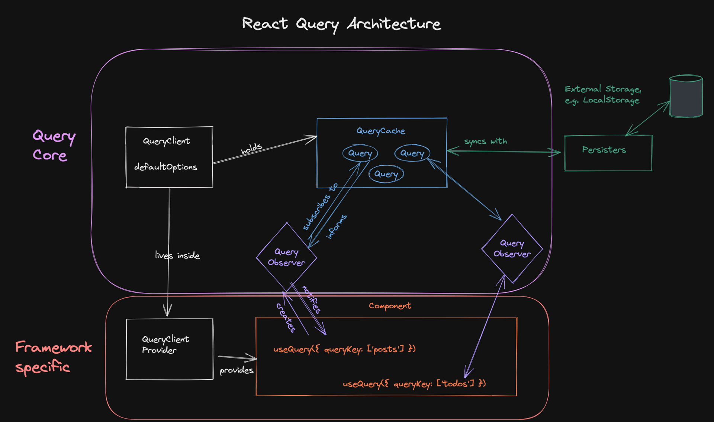

### Summary

### Advantages
```
@tanstack
  ├── query-core
  │     ├── notifyManager.ts
  │     ├── query.ts
  │     ├── queryCache.ts
  │     ├── queryClient.ts
  │     └── queryObserver.ts
  │
  └── react-query
        ├── useBaseQuery.ts
        └── useQuery.ts
```

React-Query는 크게 두 가지 주요 부분으로 나뉩니다: @tanstack/query-core와 @tanstack/react-query. 이 두 패키지는 각각 라이브러리의 핵심 기능과 리액트에서의 사용을 가능하게 해주는 역할을 합니다.

query-core/src:
- notifyManager.ts: 비동기 작업을 처리하고 쿼리 상태 업데이트를 알려주는 매니저입니다.
- query.ts: 개별 쿼리 로직을 관리합니다.
- queryCache.ts: 쿼리 결과를 캐싱하는 부분입니다.
- queryClient.ts: Query 객체와 Observer를 관리하며 리액트 부분과는 독립적입니다.
- queryObserver.ts: 쿼리의 결과를 구독하고 리액트 컴포넌트에 결과를 전달합니다.

react-query/src:
- useBaseQuery.ts: 리액트에 특화된 hook 인터페이스를 제공합니다.
- useQuery.ts: 실제로 개발자가 데이터를 가져오는 데 사용하는 훅입니다.



#### 참고 자료
- https://tkdodo.eu/blog/inside-react-query
- https://www.timegambit.com/blog/digging/react-query/01
- https://www.timegambit.com/blog/digging/react-query/02
- https://fe-developers.kakaoent.com/2023/230720-react-query/