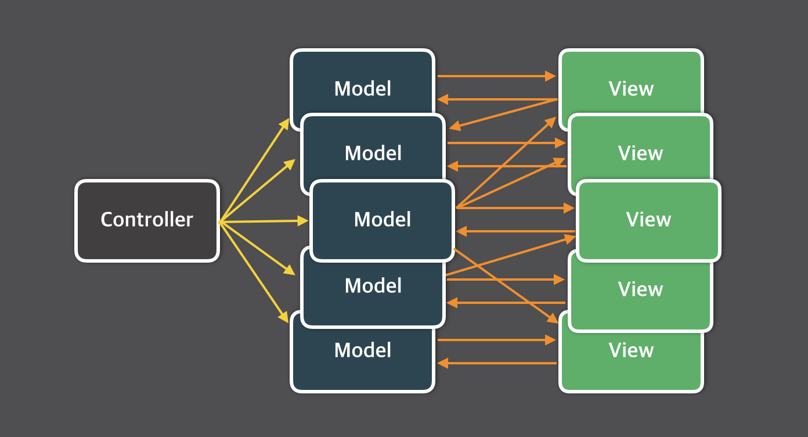
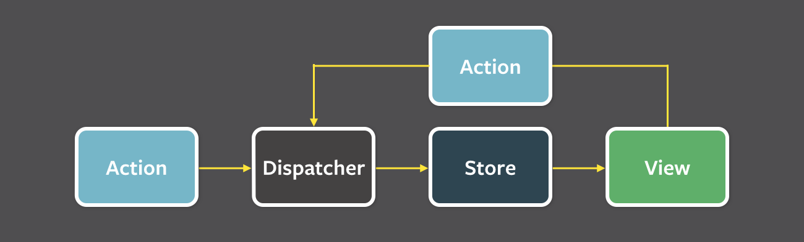

### Summary
- React 에서 상태 관리가 필요한 이유와 라이브러리에 대해서 이해할 수 있어요.

### Advantages
#### 상태 관리 패턴
##### MVC
 

<strong>양방향 데이터 흐름</strong>
MVC 패턴에서는 Model과 View 사이의 데이터 흐름이 양방향입니다. 즉, Model의 변경이 View에 반영되고, View에서의 사용자 액션도 Model에 반영됩니다. 이로 인해 애플리케이션의 상태를 추적하거나 예측하는 것이 어렵습니다. 

<strong>코드의 복잡성 증가</strong>
애플리케이션의 크기와 복잡성이 증가하면, 다수의 Model과 View가 상호작용하는 형태가 복잡해집니다. 이는 코드의 유지보수를 어렵게 만듭니다. 

<strong>종속성 문제</strong>
View와 Model 사이에 강한 종속성이 발생할 수 있습니다. 한 View가 여러 Model에 의존하거나, 한 Model이 여러 View에 의존하게 되면, 코드의 재사용성이 떨어집니다.

##### Flux

Flux는 Facebook에서 제안한 프론트엔드 아키텍처 패턴입니다. Flux는 MVC(Model-View-Controller) 패턴의 복잡성 문제를 해결하기 위해 만들어졌으며, 데이터의 단방향 흐름(Unidirectional data flow)을 지원합니다.   

Flux 패턴의 주요 구성요소는 다음과 같습니다:

1. **Dispatcher**: 모든 데이터 흐름을 관리하는 중앙 허브 역할을 합니다. 액션을 받으면 등록된 콜백 함수를 호출합니다.
2. **Store**: 애플리케이션의 상태와 로직을 관리합니다. MVC의 모델과 비슷하지만, 여러 개의 Store가 존재할 수 있으며 각 Store는 독립적입니다.
3. **View**: 사용자에게 보여지는 UI 부분으로, Store의 상태가 변경될 때마다 업데이트됩니다.
4. **Action**: 사용자의 인터랙션, 네트워크 요청 등으로부터 발생하는 데이터 패킷입니다. Dispatcher를 통해 Store로 전달됩니다.

Flux의 데이터 흐름은 다음과 같습니다:

1. 사용자의 액션(예: 버튼 클릭)이 발생하면, 해당 액션과 관련된 데이터를 Dispatcher로 전달합니다.
2. Dispatcher는 받은 액션을 적절한 Store로 전달합니다.
3. Store는 받은 액션에 따라 내부 상태를 업데이트하고, 상태가 변경되었음을 View에 알립니다.
4. View는 Store로부터 새 상태를 받아 UI를 업데이트합니다.

이렇게 <strong>데이터가 한 방향으로만 흐르므로, 애플리케이션의 복잡성이 증가해도 데이터 흐름을 추적하기 쉽습니다.</strong> 따라서 Flux 패턴은 복잡한 대규모 애플리케이션에서 특히 유용합니다.