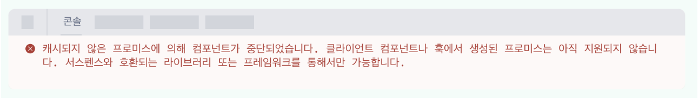
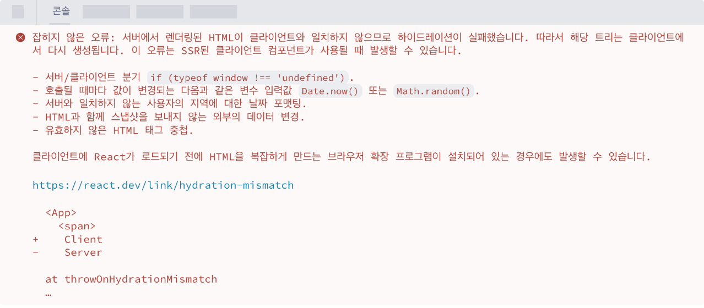

#### Actions

> 컨벤션에 따라 비동기 트랜지션을 사용하는 함수는<p style='color: red'>"액션(Actions)"</p>라고 부릅니다. 액션은 데이터 제출을 자동으로 관리합니다.

- 대기 상태: 액션은 요청이 시작될 때 함께 시작하며, 최종 상태 업데이트가 커밋되면 자동으로 재설정되는 대기 상태를 제공합니다.
- 낙관적 업데이트: 액션은 새로운 훅인 useOptimistic을 지원합니다. 사용자들이 요청을 제출했을 때 즉각적인 응답을 제공할 수 있습니다.
- 에러 처리: 액션은 에러 처리 기능을 제공하므로 요청이 실패했을 때 에러 바운더리를 표시할 수 있습니다. 또한 낙관적 업데이트로 수정된 값을 자동으로 원래의 값으로 복구할 수
  있습니다.
- 양식(form): 이제 <form> 요소에 action과 formAction 프로퍼티에 함수를 전달할 수 있습니다. action 프로퍼티에 함수를 전달하면 기본적으로 액션을
  사용하고 제출 후에 자동으로 양식을 재설정합니다.

```typescript jsx
const UpdateName = () => {
  const [name, setName] = useState("");
  const [error, setError] = useState(null);
  const [isPending, startTransition] = useTransition();

  const handleSubmit = () => {
    startTransition(async () => {
      const error = await updateName(name);
      if (error) {
        setError(error);
        return;
      }
      redirect("/path");
    })
  };

  return (
      <div>
        <input value={name} onChange={(event) => setName(event.target.value)}/>
        <button onClick={handleSubmit} disabled={isPending}>
          Update
        </button>
        {error && <p>{error}</p>}
      </div>
  );
};
```

- 비동기 트랜지션은 isPending 값을 즉시 true로 설정하며 비동기 요청을 보내고, 트랜지션이 수행되면 isPending을 false로 전환합니다. 이러한 방식은 데이터가
  변경되는 동안에도 현재 UI의 반응성 및 상호작용을 유지할 수 있습니다.

```typescript jsx
// Using <form> Actions and useActionState
const ChangeName = ({name, setName}) => {
  const [error, submitAction, isPending] = useActionState(
      async (previousState, formData) => {
        const error = await updateName(formData.get("name"));
        if (error) {
          return error;
        }
        redirect("/path");
      }
  );

  return (
      <form action={submitAction}>
        <input type="text" name="name"/>
        <button type="submit" disabled={isPending}>Update</button>
        {error && <p>{error}</p>}
      </form>
  );
};
```

```typescript jsx
import {useFormStatus} from 'react-dom';

const DesignButton = () => {
  const {pending} = useFormStatus();
  return <button type="submit" disabled={pending}/>
};
```

```typescript jsx
function ChangeName({currentName, onUpdateName}) {
  const [optimisticName, setOptimisticName] = useOptimistic(currentName);

  const submitAction = async formData => {
    const newName = formData.get("name");
    setOptimisticName(newName);
    const updatedName = await updateName(newName);
    onUpdateName(updatedName);
  };

  return (
      <form action={submitAction}>
        <p>Your name is: {optimisticName}</p>
        <p>
          <label>Change Name:</label>
          <input
              type="text"
              name="name"
              disabled={currentName !== optimisticName}
          />
        </p>
      </form>
  );
}
```

리액트 19에서는 렌더링에서 리소스를 읽는 새로운 API인 use를 도입합니다.

예를 들어 use로 프로미스를 읽는 경우, 프로미스가 해결(resolve)될 때까지 리액트는 일시 중단됩니다.

use는 렌더링 중 생성된 프로미스를 지원하지 않습니다.

렌더링 중 생성된 프로미스를 use에 전달하면 리액트는 아래와 같은 경고를 표시합니다.

캐시되지 않은 프로미스에 의해 컴포넌트가 중단되었습니다. 서스펜스와 호환되는 라이브러리 또는 프레임워크를 제외하고는 클라이언트 컴포넌트나 훅에서 생성된 프로미스는 아직 지원되지
않습니다.

이를 해결하려면 프로미스 캐싱을 지원하는 서스펜스 기반의 라이브러리 또는 프레임워크에서 프로미스를 전달해야 합니다. 향후 렌더링에서 프로미스를 더 쉽게 캐싱하는 기능을 제공할
계획입니다.

```typescript jsx
import {use} from 'react';

const Comments = ({commentsPromise}) => {
  // `use`는 프로미스가 해결될 때까지 일시 중단됩니다.
  const comments = use(commentsPromise);
  return comments.map(comment => <p key={comment.id}>{comment}</p>);
};

const Page = ({commentsPromise}) => {
  // Comments에서 `use`가 일시 중단되면,
  // 이 컴포넌트의 서스펜스 바운더리가 보여집니다.
  return (
      <Suspense fallback={<div>Loading...</div>}>
        <Comments commentsPromise={commentsPromise}/>
      </Suspense>
  )
};
```

개선점

- 프로퍼티가 된 ref
    - forwardRef를 사용하지 않고 기본으로 프로퍼티에 들어가게 됩니다.

```typescript jsx
function MyInput({placeholder, ref}) {
  return <input placeholder={placeholder} ref={ref}/>
}

//...
<MyInput ref={ref}/>
```

- 하이드레이션 에러 개선
    - 리액트 19에서는 어떻게 불일치가 발생했는지 하나의 에러 메시지로만 기록합니다.



- 프로바이더가 된 <Context>

```typescript tsx
const ThemeContext = createContext('');

function App({children}) {
  return (
      <ThemeContext value = "dark" >
          {children}
          < /ThemeContext>
  );
}
```

- ref를 위한 클린업 함수

```typescript jsx
<input
    ref={(ref) => {
      // ref가 생성됨

      // 추가된 사항: 요소가 DOM에서 제거되었을 때
      // ref를 재설정하는 클린업 함수를 반환합니다
      return () => {
        // ref 클린업
      };
    }}
/>
```

- 컴포넌트가 언마운트 되었을 때, 리액트는 ref 콜백에서 반환된 클린업 함수를 호출합니다. DOM ref뿐만 아니라 클래스 컴포넌트의 ref,
  useImperativeHandle에서도 동작합니다.
- 이전 리액트는 컴포넌트가 언마운트 될 때 ref 함수를 null과 함께 호출했습니다. ref가 클린업 함수를 반환한다면 이제 리액트는 이 단계를 건너 뜁니다. 향후 버전에서는
  컴포넌트를 언마운트할 때 null과 ref를 호출하는 것을 폐기할 예정입니다.

추가적인 개선점

1. 문서 메타 데이터 지원
2. 스타일시트 지원
3. 비동기 스크립트 지원
- 모든 렌더링 환경에서 여러 다른 컴포넌트에 의해 비동기 스크립트가 렌더링되더라도 리액트가 스크립트를 한 번만 로드하고 실행하므로 중복이 제거됩니다.
- 서버 사이드 렌더링에서 비동기 스크립트는 <head>에 포함되며 스타일시트, 폰트 및 이미지 프리로드와 같이 화면 그리기를 차단하는 더 중요한 리소스 다음으로 우선순위가 지정됩니다.
````typescript jsx
  function MyComponent() {
    return (
            <div>
              <script async={true} src="..." />
              Hello World
            </div>
    )
  }
  
  function App() {
    <html>
    <body>
    <MyComponent>
      ...
      <MyComponent> // DOM에 중복된 스크립트를 생성하지 않습니다.
    </body>
    </html>
  }
  ````
  
