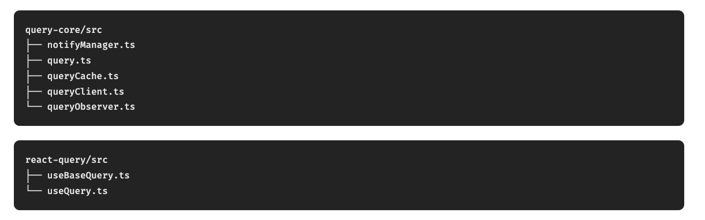
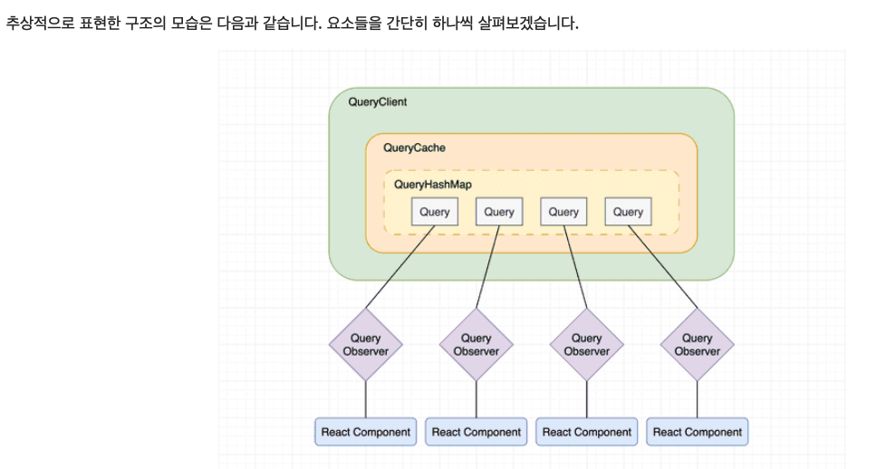
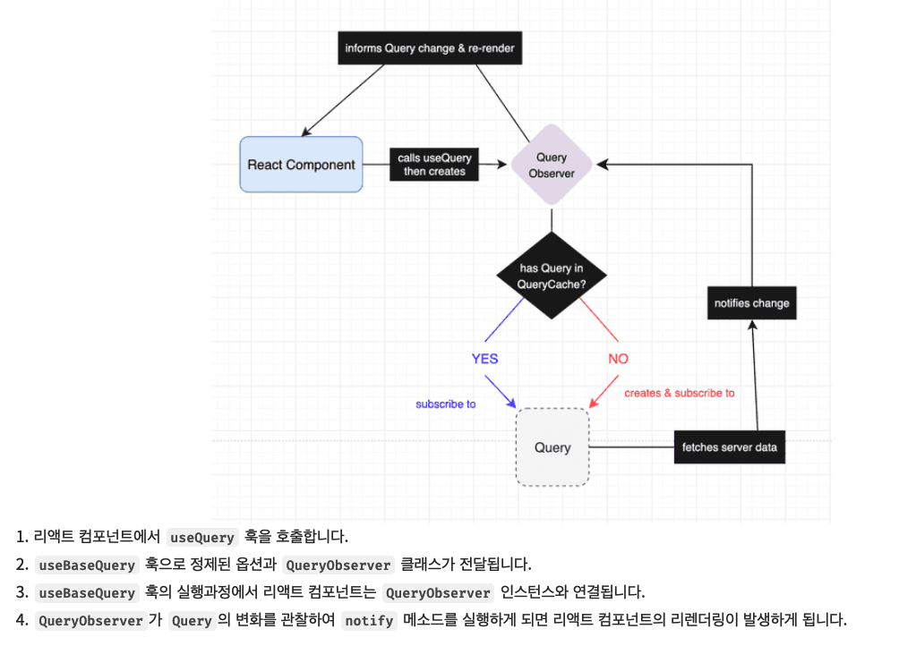

#### Summary

- useQuery의 기본 콘셉트와 사용법을 알아보자
- 어떻게 useQuery 는 react의 state를 변경 할 수 있는가?

#### Advantages

- react-query는 캐쉬를 통해 데이터를 관리한다.
  - 캐쉬는 쿼리키로 관리하며 Map으로 구현된 Store로 관리되며 queryHash에서 query-key를 찾아서 데이터를 가져온다.
  - 각 쿼리는 옵저버를 하나씩 생성해서 가지고 있다. 모든 옵저버는 쿼리의 상태를 관리하고 쿼리의 상태가 변경되면 옵저버에게 알려준다.
  - 리액트 상태 업데이트는 v5 부터는 useExternalStore를 사용하여 상태를 업데이트 한다.

#### Disadvantages

#### Example Case




- ```typescript
  export class QueryClient {
    #queryCache: QueryCache; // useQuery의 Cache 관리
    #mutationCache: MutationCache; // useMutation Cache 관리

    constructor(config: QueryClientConfig = {}) {
      this.queryCache = config.queryCache || new QueryCache(); // 객체내에서 Map으로 관리 new Map<string, Query> === QueryStore
      this.#mutationCache = config.mutationCache || new MutationCache();
    }

    setQueryData() {}
    getQueryData() {}
    invalidateQueries() {}
    getQueryCache() {}
  }
  ```

- ```typescript
  export function useQuery(
    options: UseQueryOptions,
    queryClient?: QueryClient
  ) {
    return useBaseQuery(options, QueryObserver, queryClient);
  }
  ```
- ```typescript
  // useBaseQuery
  const [observer] = React.useState(
    () => new Observer(queryClient, defaultedOptions)
  );

  React.useSyncExternalStore(
    React.useCallback(
      onStoreChange => {
        const unsubscribe = isRestoring
          ? () => undefined
          : observer.subscribe(notifyManager.batchCalls(onStoreChange));
        observer.updateResult();

        return unsubscribe;
      },
      [observer, isRestoring]
    ),
    () => observer.getCurrentResult(),
    () => observer.getCurrentResult()
  );
  ```

  이 리액트 컴포넌트의 리렌더링을 지시하는 함수 onStoreChange는 observer.subscribe(onStoreChange) 문장을 따라 이동하는데 subscribe 메소드는 QueryObserver클래스의 부모 클래스인 Subscribable에서 구현하고 있기 때문에 이 부분의 구현을 살펴볼 수 있습니다. Set 자료형인 listeners 필드에 함수가 추가되는 것을 확인할 수 있습니다.

- ```typescript
  export class Subscribable<TListener extends Function = Listener> {
    protected listeners: Set<{ listener: TListener }>;

    constructor() {
      this.listeners = new Set();
      this.subscribe = this.subscribe.bind(this);
    }

    subscribe(listener: TListener): () => void {
      this.listeners.add(listener);

      this.onSubscribe();

      return () => {
        this.listeners.delete(listener);
        this.onUnsubscribe();
      };
    }
  }
  ```

- ```typescript
  export class QueryObserver extends Subscribable {
    constructor() {}

    #notify(notifyOptions: NotifyOptions): void {
      notifyManager.batch(() => {
        // First, trigger the listeners
        if (notifyOptions.listeners) {
          this.listeners.forEach(listener => {
            listener(this.#currentResult);
          });
        }

        // Then the cache listeners
        this.#client.getQueryCache().notify({
          query: this.#currentQuery,
          type: "observerResultsUpdated",
        });
      });
    }
  }
  ```

  

#### Wrap-up

- 전체적으로 느낀 점을 작성해요.
